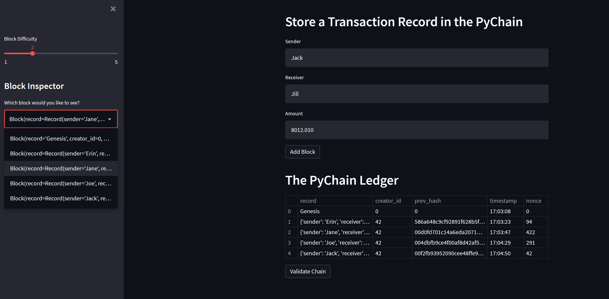
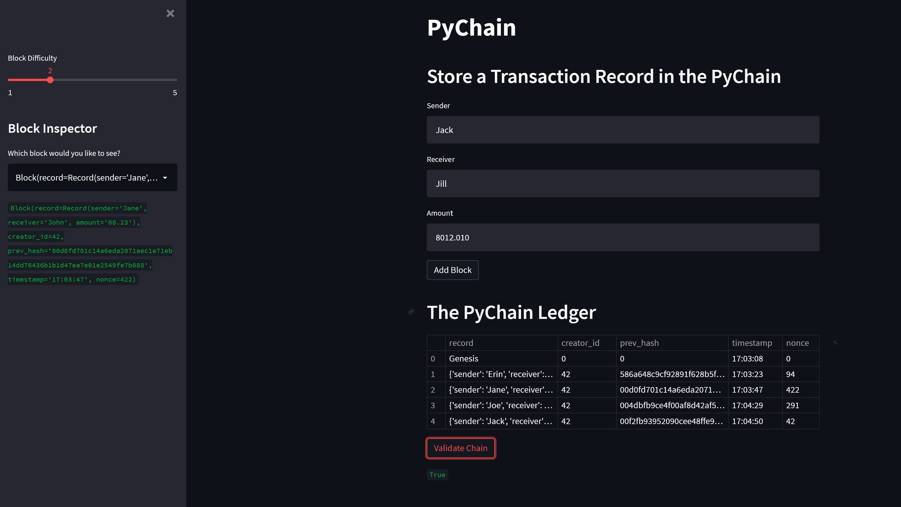

# Module_18_Challenge
FinTech Boot Camp Module 18: Blockchain with Python - Streamlit, Hashing, & Proof-of-Work

---

WhaleBank has made the important step to transitioning the traditional internal ledger system to a blockchain-based one. A top priority was a user-friendly web interface, as the nuances of blockchain technology are not understood by the majority of users at this time. The new ledger allows partner banks to transfer money between senders and receivers, as well as verify the integrity of all data in the ledger. 

---

## Interface View

Block creation:



Block validation:



---

## Technologies

This application was written in Python 3.9.4 on a Windows 10 machine. 

[Streamlit](https://docs.streamlit.io/library/get-started) is an open-source Python library that makes it easy to create and share custom web apps for machine learning and data science. The library imported for this program includes a 'Get Started' guide, API reference, and more advanced features of the core library including caching, theming, and Streamlit Components. Cloud deployment services are offered as well.

---

## Installation Guide

Ensure through your local terminal that your development environment supports the following imports and dependencies:

```
import streamlit as st
from dataclasses import dataclass
from typing import Any, List
import datetime as datetime
import pandas as pd
import hashlib
```

If it does not, reference your terminal installation guide to download the missing software.

---

## Contributors

Brought to you by lead DeFi developer Erin Kenny at WhaleBank.

[Email](ekenny3@uncc.edu)

[LinkedIn](www.linkedin.com/in/e-kenny)

---

## License

MIT

License file included in repository.